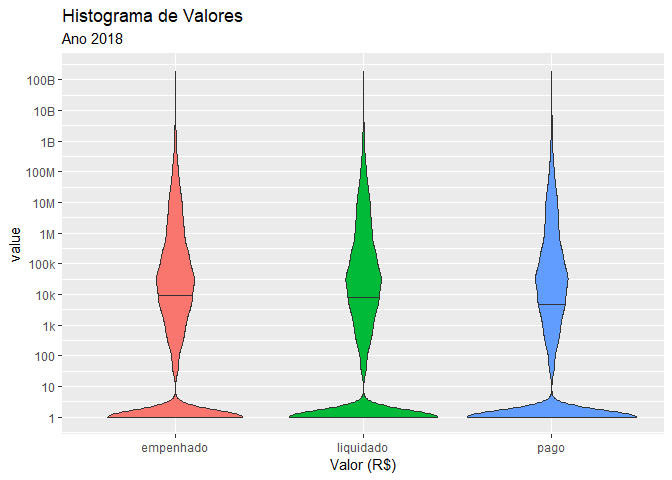
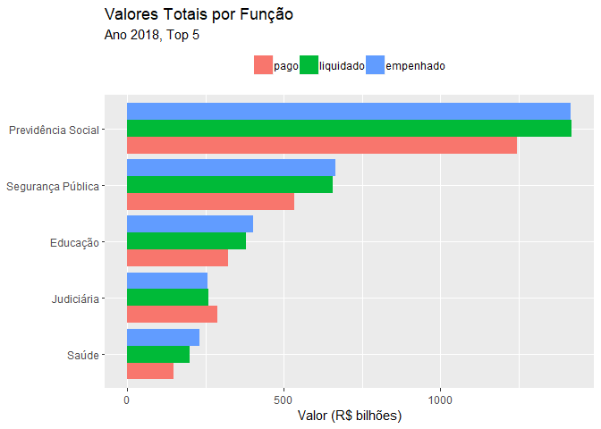

Empenho: Análise dos Dados, 2018
================

Inclusão de pacotes

``` r
library(tidyverse)
#> Warning: package 'tidyverse' was built under R version 3.5.3
#> Warning: package 'tibble' was built under R version 3.5.3
#> Warning: package 'tidyr' was built under R version 3.5.3
#> Warning: package 'readr' was built under R version 3.5.3
#> Warning: package 'purrr' was built under R version 3.5.3
#> Warning: package 'dplyr' was built under R version 3.5.3
#> Warning: package 'stringr' was built under R version 3.5.3
#> Warning: package 'forcats' was built under R version 3.5.3
library(fs)
#> Warning: package 'fs' was built under R version 3.5.3
```

Checa tamanho dos arquivos

``` r
dir_info("data") %>%
  select(path,size,modification_time)
#> # A tibble: 4 x 3
#>   path                                 size modification_time  
#>   <fs::path>                    <fs::bytes> <dttm>             
#> 1 data/despesa.zip                  125.32M 2019-03-29 07:40:36
#> 2 data/despesa2018.zip               17.98M 2019-03-29 16:40:21
#> 3 data/despesa2018_squished.zip       9.08M 2019-04-06 12:14:07
#> 4 data/df_all.rds                    24.37M 2019-03-30 12:05:39
```

# Leitura de Dados Higienizados

Colocar num data frame (“tibble”). Nota: arquivo agora ’e UTF-8

``` r
fname_2018_squished_zip <- "data/despesa2018_squished.zip"
df_orcamento <- read_delim(fname_2018_squished_zip,delim=";",
                           quote="'") # evita erro com "
#> Parsed with column specification:
#> cols(
#>   .default = col_character(),
#>   Poder = col_double(),
#>   Grupo = col_double(),
#>   `Nome Grupo` = col_logical(),
#>   `Modalidade de Aplicação` = col_double(),
#>   Elemento = col_double(),
#>   `Sub Elemento` = col_double(),
#>   Empenho = col_double(),
#>   `Valor Empenhado` = col_number(),
#>   `Valor Liquidado` = col_number(),
#>   `Valor Pago` = col_number()
#> )
#> See spec(...) for full column specifications.
glimpse(df_orcamento)
#> Observations: 99,362
#> Variables: 32
#> $ Poder                          <dbl> 1, 1, 1, 1, 1, 1, 1, 1, 1, 1, 1...
#> $ `Nome Poder`                   <chr> "Executivo", "Executivo", "Exec...
#> $ Grupo                          <dbl> 3, 3, 3, 3, 3, 3, 3, 3, 3, 3, 3...
#> $ `Nome Grupo`                   <lgl> NA, NA, NA, NA, NA, NA, NA, NA,...
#> $ `Modalidade de Aplicação`      <dbl> 90, 90, 90, 90, 90, 90, 90, 90,...
#> $ `Nome Modalidade de Aplicação` <chr> "Aplicações Diretas", "Aplicaçõ...
#> $ Elemento                       <dbl> 339036, 339014, 339039, 339030,...
#> $ `Nome Elemento`                <chr> "Outros Serviços de Terceiros -...
#> $ `Sub Elemento`                 <dbl> NA, NA, NA, NA, NA, NA, NA, NA,...
#> $ `Nome Sub Elemento`            <chr> NA, NA, NA, NA, NA, NA, NA, NA,...
#> $ Órgão                          <chr> "21", "31", "29", "21", "40", "...
#> $ `Nome Órgão`                   <chr> "Secretaria de Estado da Casa C...
#> $ UO                             <chr> "2133", "3131", "2961", "2104",...
#> $ `Nome UO`                      <chr> "Departamento de Trânsito do Es...
#> $ UG                             <chr> "263100", "053100", "296100", "...
#> $ `Nome UG`                      <chr> "DEPARTAMENTO DE TRANSITO DO RI...
#> $ Credor                         <chr> "965.197.977-15", "042.670.427-...
#> $ `Nome Credor`                  <chr> "ALEXANDRE CESAR DE SOUZA", "LU...
#> $ `Fonte de Recursos`            <chr> "32", "12", "22", "00", "00", "...
#> $ `Nome Fonte de Recursos`       <chr> "Taxas pelo Exercício do Poder ...
#> $ Processo                       <chr> "E-12/061/7244/20", "E-12/171/1...
#> $ Função                         <chr> "06", "22", "10", "04", "13", "...
#> $ `Nome Função`                  <chr> "Segurança Pública", "Indústria...
#> $ `Sub Função`                   <chr> "122", "122", "302", "122", "12...
#> $ `Nome Sub Função`              <chr> "Administração Geral", "Adminis...
#> $ Licitação                      <chr> "05", "07", "09", "09", "05", "...
#> $ `Nome Licitação`               <chr> "DISPENSA", "NAO APLICAVEL", "P...
#> $ Empenho                        <dbl> 4390, 1354, 7927, 561, 752, 140...
#> $ Histórico                      <chr> "Cancelamento conforme Decreto ...
#> $ `Valor Empenhado`              <dbl> 0, 0, 0, 0, 0, 0, 0, 0, 0, 0, 0...
#> $ `Valor Liquidado`              <dbl> 0, 0, 0, 0, 0, 0, 0, 0, 0, 0, 0...
#> $ `Valor Pago`                   <dbl> 0, 0, 0, 0, 0, 0, 0, 0, 0, 0, 0...
```

``` r
problems(df_orcamento)
#> [1] row      col      expected actual  
#> <0 rows> (or 0-length row.names)
```

Quantas linhas, colunas, ou dimensões?

``` r
# nrow(df_orcamento)
# ncol(df_orcamento)
dim(df_orcamento)
#> [1] 99362    32
```

# Análise do “Empenho”

Calcula sumarização de colunas que parecem conter valores:

``` r
summary(df_orcamento%>%select(contains("empenh"),
                              contains("valor")))
#>     Empenho      Valor Empenhado     Valor Liquidado    
#>  Min.   :    1   Min.   :0.000e+00   Min.   :0.000e+00  
#>  1st Qu.:  236   1st Qu.:0.000e+00   1st Qu.:0.000e+00  
#>  Median :  659   Median :2.588e+03   Median :1.254e+03  
#>  Mean   : 2475   Mean   :3.747e+07   Mean   :3.768e+07  
#>  3rd Qu.: 2085   3rd Qu.:9.188e+04   3rd Qu.:7.438e+04  
#>  Max.   :27484   Max.   :1.930e+11   Max.   :1.930e+11  
#>    Valor Pago       
#>  Min.   :0.000e+00  
#>  1st Qu.:0.000e+00  
#>  Median :2.750e+02  
#>  Mean   :3.315e+07  
#>  3rd Qu.:4.694e+04  
#>  Max.   :1.930e+11
```

Quantas linhas não preenchidas (com ‘NA’)?

``` r
df_orcamento$`Valor Empenhado` %>% is.na %>% sum
#> [1] 0
```

Renomeia colunas a serem utilizadas

``` r
df_orcamento_clean <- df_orcamento %>%
  rename(func_cod=`Função`,
         func=`Nome Função`,
         empenhado=`Valor Empenhado`,
         liquidado=`Valor Liquidado`,
         pago=`Valor Pago`)
```

Plota histograma dos Valores Empenhados, Liquisdados e Pagos:

``` r
df_orcamento_clean %>%
  transmute_at(vars(empenhado,liquidado,pago),~.+1) %>% # for log
  mutate(row=row_number()) %>%
  gather("key","value",-row) %>%
  mutate(key=factor(key,levels=c("empenhado","liquidado","pago"))) %>%
  ggplot(aes(key,value,fill=key)) +
  geom_violin(draw_quantiles = c(.5)) +
  scale_y_log10(breaks=10^(0:11),labels=c(1,10,100,
                                          "1k","10k" ,"100k" ,
                                          "1M","10M","100M",
                                          "1B","10B","100B"))+
  labs(title="Histograma de Valores",
       subtitle="Ano 2018",
       x="Valor (R$)") +
  theme(legend.position = "none")
```

<!-- -->

# Estudo por Função

Nomes das funções são únicas por código?

``` r
df_orcamento_clean %>%
  count(func_cod,func) %>%
  count(func_cod,name="nn") %>%
  count(nn)
#> # A tibble: 1 x 2
#>      nn     n
#>   <int> <int>
#> 1     1    25
```

Quantos por Função?

``` r
df_orcamento_clean %>%
  count(func_cod,func,sort=T)
#> # A tibble: 25 x 3
#>    func_cod func                    n
#>    <chr>    <chr>               <int>
#>  1 12       Educação            30588
#>  2 06       Segurança Pública   12812
#>  3 10       Saúde               11441
#>  4 26       Transporte           5684
#>  5 03       Essencial à Justiça  5428
#>  6 20       Agricultura          4932
#>  7 04       Administração        4479
#>  8 08       Assistência Social   2722
#>  9 02       Judiciária           2436
#> 10 23       Comércio e Serviços  2410
#> # ... with 15 more rows
```

Valores por função:

``` r
df_orcamento_clean %>%
  group_by(func) %>% {
    ns <- summarize(.,n=n())
    ss <- summarize_at(.,vars(empenhado,liquidado,pago),
                 list(sum=~sum(.),
                      mean=~mean(.),
                      median=~median(.),
                      sd=~sd(.),
                      mad=~mad(.)))
    ns %>% inner_join(ss,by="func")
    } %>%
  mutate_at(vars(-func),~(./10^3)%>%as.integer) %>%
  arrange(-n)
#> # A tibble: 25 x 17
#>    func      n empenhado_sum liquidado_sum pago_sum empenhado_mean
#>    <chr> <int>         <int>         <int>    <int>          <int>
#>  1 Educ~    30     401164009     378952112   3.23e8          13115
#>  2 Segu~    12     665571698     655641842   5.33e8          51949
#>  3 Saúde    11     230771890     199187734   1.46e8          20170
#>  4 Esse~     5      88609648     166434811   1.62e8          16324
#>  5 Tran~     5      91109975      58852547   5.62e7          16029
#>  6 Admi~     4     157196580     153486935   1.50e8          35096
#>  7 Agri~     4      24201227      25465374   1.49e7           4906
#>  8 Assi~     2      21152202      11160642   1.48e7           7770
#>  9 Comé~     2       9032679      16080292   1.35e7           3747
#> 10 Gest~     2      14260404      13784206   1.09e7           6125
#> # ... with 15 more rows, and 11 more variables: liquidado_mean <int>,
#> #   pago_mean <int>, empenhado_median <int>, liquidado_median <int>,
#> #   pago_median <int>, empenhado_sd <int>, liquidado_sd <int>,
#> #   pago_sd <int>, empenhado_mad <int>, liquidado_mad <int>,
#> #   pago_mad <int>
```

Empenhos por função: Top 5

``` r
df_orcamento_clean %>%
  mutate(func=func%>%fct_reorder(-empenhado,sum)) %>%
  filter(as.integer(func)<6) %>%
  mutate(func=func%>%fct_rev) %>% # for coord_flip
  group_by(func) %>%
  # milhoes
  summarize_at(vars(empenhado,liquidado,pago),
               list(~(sum(.)/10^9))) %>%
  gather("key","value",-func) %>%
  mutate(key=factor(key,levels=c("pago","liquidado","empenhado"))) %>%
  ggplot(aes(func,value,group=key,fill=key)) +
  geom_col(position="dodge") +
  coord_flip() +
  labs(title="Valores Totais por Função",
       subtitle="Ano 2018, Top 5",
       y="Valor (R$ bilhões)") +
  theme(legend.position = "top",
        legend.title = element_blank(),
        axis.title.y=element_blank())
```

<!-- -->

``` r
ggsave("pics/valores_por_funcao.png")
#> Saving 7 x 5 in image
```

Distribuição do Empenho por Órgão (boxbplot)

``` r
df_orcamento_clean %>%
  mutate(func=func%>%fct_reorder(empenhado+1,.fun=median,.desc=T)) %>%
  filter(as.integer(func)<6) %>%
  mutate(func=func%>%fct_rev) %>% # for coord_flip
  ggplot(aes(func,empenhado+1)) +
  geom_boxplot(aes(fill=func),notch=T) +
  scale_y_log10(breaks=10^c(0,3,6,9),labels=c("1","1k","1M","1B"))+
  coord_flip() +
  labs(title="Distribuição dos Valores por Função",
       subtitle="Ano 2018, Top 5 medianas",
       y="Valor (R$)") +
  theme(legend.position = "none",
        axis.title.y=element_blank())
```

<!-- -->
